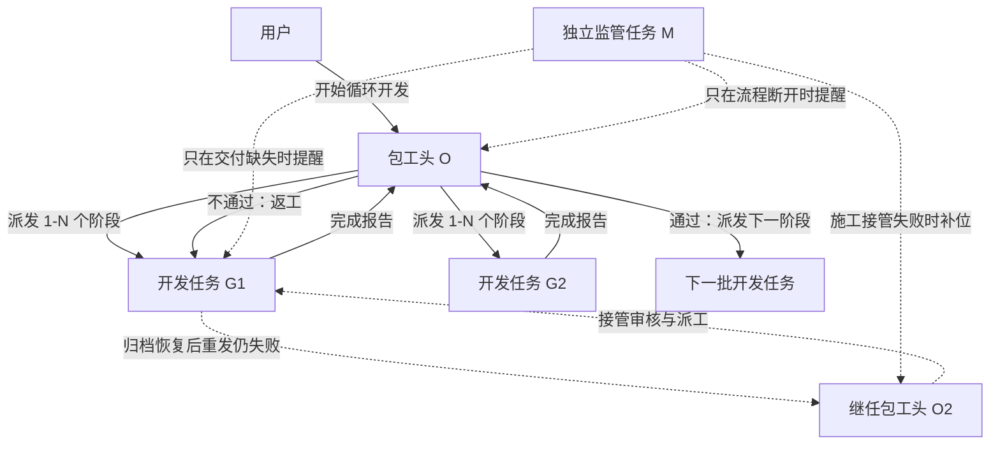
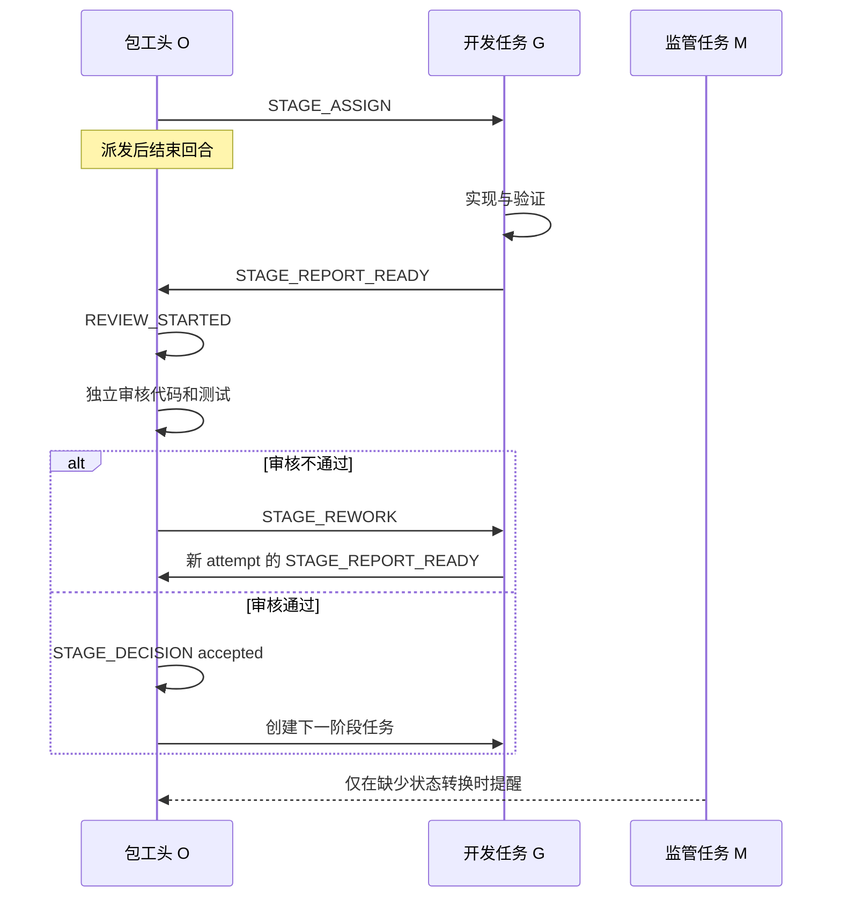

# Codex 循环开发系统：从零开始使用教程

这套系统适合把一个较长的开发计划交给多个 Codex 任务持续执行。

你只需要先写好计划，然后在一个 Codex 任务中说“开始循环开发”。系统会自动建立包工头、开发任务和独立监管任务，完成派工、审核、返工、下一阶段派发与最终收尾。总包任务损坏时，还可以从持久状态自动创建继任总包。

## 1. 先理解三个角色



### 包工头 O

包工头是整个开发循环的唯一负责人。

它负责：

- 读取开发计划和 Checklist。
- 判断哪些阶段可以开始。
- 一次创建 1–N 个开发任务。
- 独立审核开发任务的代码和测试。
- 决定通过、返工、部分完成或阻塞。
- 通过后派发下一阶段。
- 全部完成后停用定时监管任务。

包工头派发完任务后会结束当前回合，不会一直轮询。

### 开发任务 G

每个开发任务通常只负责一个阶段，例如 G01、G02 或 G15。

它负责：

- 在授权范围内修改代码。
- 运行阶段要求的测试。
- 整理证据并主动发回包工头。
- 收到返工要求后继续在原任务中修复。

所有开发任务固定使用 `gpt-5.6-luna` 和 `max` 推理。这个配置会保存在 durable state 中，因此总包自动切换后也不会改变。

开发任务不能自行宣布阶段正式通过，也不能创建下一阶段。它唯一可以创建的控制任务，是在首次发送失败后完成总包 archive → unarchive 原位修复、修复后重发仍失败并成功取得接管权时，新建一个继任总包。

### 独立监管任务 M

监管任务使用 Luna、xhigh 推理，并通过定时任务运行。

它只负责检查流程有没有断开，例如：

- 开发任务完成了，却没有把报告发给包工头。
- 包工头收到报告，却没有开始审核。
- 包工头开始审核，却一直没有给出结论。
- 阶段通过了，却没有派发下一阶段。

监管任务不能审核代码、不能决定通过、不能修改仓库，也不能代替包工头派工。如果施工线程发起的总包接管没有完成，监管可以继续同一次接管并创建候选总包，但候选必须自行完成激活。

## 2. 开始前需要准备什么

### 2.1 先认识几个名词

| 名词 | 简单解释 |
|---|---|
| `runId` | 一次循环开发的唯一名字，例如 `shape-recipe-20260801`。所有恢复、暂停和状态查询都用它避免找错任务。 |
| Stage | 一个开发阶段，例如 G01。 |
| attempt | 同一阶段的第几轮实现；返工一次通常会增加一次 attempt。 |
| Checklist | 某个阶段的详细施工和验收清单。简单项目可以只用一份完整计划。 |
| durable state | 保存在本地磁盘上的运行状态，是重启后的恢复依据。 |
| Outbox | worker 在发送消息前写入的不可变报告文件，防止总包或消息链损坏时丢失交付。 |
| foreman epoch | 当前总包的代际号。每次正式接管加一，旧代际恢复后也不能继续审核或派工。 |
| repair lease | 多线程同时发现故障时，只允许一个线程执行 archive → unarchive 的短期修复权。 |
| takeover | 原位修复后重发仍失败时，把旧总包隔离并创建继任总包的原子接管事务。 |
| `expectedNext` | 当前流程正在等待的下一个动作，以及应当由哪个任务执行。 |
| Shared Contract Lock | 表示多个阶段会修改同一份共享契约，持有相同锁的阶段不能随意并行。 |
| Release Cut | 一个需要用户确认的版本节点。到达后必须等待 `go`、`hold` 或 `redirect`。 |

### 2.2 确认系统已经安装

本教程从“第一次使用”开始讲，但不重新开发循环系统本身。开始前，本机必须已经安装全局技能：

```text
C:\Users\<用户名>\.agents\skills\loop-development\SKILL.md
```

如果技能目录是刚复制或刚更新的，运行一次：

```powershell
node C:\Users\<用户名>\.agents\bin\sync-agents.mjs
```

然后新建或重新打开一个 Codex 任务，让技能列表刷新。如果技能文件不存在，需要先取得完整的 `loop-development` 技能目录；仅输入 Prompt 不能凭空创建这套运行协议。

还需要确认：

- Codex 桌面端能够创建和读取任务。
- 支持任务间发送消息。
- 支持创建和更新自动任务。
- 模型列表中可以使用 Luna，并支持 `xhigh`。

可以先在目标仓库任务中运行一次只读预检：

```text
请只做循环开发启动预检，不创建任务、不修改文件、不创建自动任务。

检查：
1. 能否加载 $loop-development；
2. 能否使用任务创建、任务读取、任务间消息和 automation_update；
3. 当前任务的 cwd 是否就是目标仓库；
4. 当前仓库是否已保存为 Codex local 项目；
5. 是否可以创建 Luna xhigh 任务。

最后只输出 LOOP_PREFLIGHT_READY，或列出缺失能力。
```

### 2.3 使用 Codex 桌面端

循环开发依赖 Codex 桌面端的任务创建、任务间消息和自动任务功能。

仓库最好已经保存为 Codex 项目。默认情况下，新开发任务直接使用这个项目的本地目录，不创建额外 worktree 或分支。

打开目标仓库后，确认任务详情中的 `cwd` 是仓库真实绝对路径。创建开发任务时，循环系统会复用这个保存项目的 `local` 环境。

### 2.4 准备开发计划

开发计划至少要说明：

- 要实现什么目标。
- 分成哪些阶段。
- 每个阶段依赖哪些前置阶段。
- 每个阶段允许修改什么范围。
- 每个阶段如何验收。
- 哪些位置必须等待用户决定。
- 最多允许多少任务并行。

推荐使用稳定的阶段编号，例如 G01、G02、G03。

一个最小计划可以这样写：

```markdown
# 示例开发计划

## 总目标

实现一个可以保存、重新打开并继续编辑的建模功能。

## 并行规则

- 最大并行数：2
- 写入范围冲突时必须串行
- 不自动提交 Git

## G01：建立数据模型

- dependsOn：无
- 允许修改：src/model/**、tests/model/**
- 禁止修改：src/ui/**、发布配置
- Shared Contract Lock：model-schema-v1
- 目标：建立稳定的数据结构和序列化格式
- 验收命令：`pnpm test model`
- 通过条件：单元测试通过；保存和读取结果一致
- 并行关系：必须先完成，不能与依赖该 schema 的阶段并行

## G02：实现编辑操作

- dependsOn：G01 accepted
- 允许修改：src/editor/**、tests/editor/**
- 禁止修改：src/model/schema/**、src/ui/**
- Shared Contract Lock：editor-contract-v1
- 目标：实现创建和编辑操作
- 验收命令：`pnpm test editor`
- 通过条件：创建、编辑、撤销、重做测试通过
- 并行关系：G01 通过后可以与不使用 editor-contract-v1 的阶段并行

## G03：接入界面

- dependsOn：G02 accepted
- 允许修改：src/ui/**、tests/ui/**
- 禁止修改：src/model/**、src/editor/core/**
- Shared Contract Lock：ui-editor-bridge-v1
- 目标：接入用户界面
- 验收命令：`pnpm test ui`、真实浏览器旅程
- 通过条件：自动测试和真实交互流程通过
- 并行关系：依赖 G02，不得提前开始

## 用户决策门

- gateId：release-v0.1
- G03 通过后暂停，等待用户决定是否发布。
```

Checklist 是可选的：

- 小项目可以把阶段细节和验收标准全部写在主计划中。
- 大项目建议主计划负责依赖 DAG、并行边界和 Release Cut，阶段 Checklist 负责具体施工项、测试和 Evidence。
- 主计划与 Checklist 冲突时必须停止并让用户决定，不能由包工头自行猜测。

一个最小 Checklist 可以这样写：

```markdown
# G01 Checklist

- stageId: G01
- status: draft
- dependsOn: []

## 施工项

- [ ] 建立数据结构
- [ ] 建立序列化

## 验收

- [ ] `pnpm test model`
- [ ] 保存后重新读取结果一致

## Evidence

- 待施工
```

### 2.5 如果还没有计划

可以先在仓库任务中输入下面的 Prompt：

```text
请先不要开始开发。

根据当前仓库事实和我的目标，编写一份可执行的分阶段开发计划。每个阶段必须包含：
- 稳定阶段 ID
- 目标和交付物
- 前置依赖
- 允许与禁止写入范围
- 独立验收标准和测试命令
- 与其他阶段的并行关系
- 必须等待用户决定的位置

计划完成后停下，等待我审核，不要创建开发任务。
```

先人工检查计划是否符合你的真实目标。确认计划后，再开始循环开发。

## 3. 正式启动循环开发

### 第一步：打开包工头任务

在 Codex 桌面端中打开目标仓库的一个任务。这个任务将成为包工头 O。

建议使用一个长期保留、标题清楚的任务，例如：

```text
项目名称｜循环开发包工头
```

不要在开发 worker 或监管任务里输入启动命令。

### 第二步：发送启动 Prompt

不要只输入一句“开始循环开发”。仓库中可能存在旧计划、草稿或多个相似 Checklist，模型可能选错。

安全的最低输入必须包含唯一 `runId` 和主计划绝对路径：

```text
开始循环开发。
runId：<本次运行的唯一名称>
主计划：<开发计划的绝对路径>
```

推荐使用下面这份完整模板：

```text
开始循环开发。

请使用 $loop-development，将当前任务作为唯一包工头 O。

runId：<唯一名称，例如 project-feature-20260801>
主计划：<开发计划的绝对路径>
Checklist 或索引：<Checklist 的绝对路径；没有可省略>

请根据计划、依赖、写入范围和当前仓库状态，自行决定第一批启动 1–N 个开发任务。

要求：
- 开发任务直接使用当前保存项目的 local 环境。
- 所有开发任务固定使用 gpt-5.6-luna、max 推理。
- 不创建 worktree 或分支，不自动 commit。
- 包工头负责独立审核、返工和下一阶段派发。
- worker 完成或阻塞后必须主动向包工头发送结构化报告。
- worker 先把完整报告写入 Outbox；首次明确发送错误时先取得 repair lease 并执行 archive → unarchive，重发仍失败才允许发起受限的自动接管。
- 创建独立 Luna xhigh 监管任务和 20 分钟定时任务；监管只负责兜底。
- 派发完成后结束当前回合，不持续轮询。
- 不得越过计划中的用户决策门。
```

实际示例：

```text
开始循环开发。

请使用 $loop-development，将当前任务作为唯一包工头 O。

runId：example-model-editor-20260801
主计划：C:\项目\docs\plans\main-plan.md
Checklist：C:\项目\docs\checklists\README.md

请按计划和当前代码事实自行决定第一批 1–3 个互不冲突的开发任务。所有任务使用当前保存项目的 local 环境，不建分支或 worktree，不自动提交。包工头独立验收，通过后继续派发，不通过则退回原任务返工。创建 Luna xhigh 独立监管任务，每 20 分钟兜底检查一次。派发后结束回合。
```

### 第三步：检查启动结果

正常启动后，你会看到：

1. 当前任务成为包工头。
2. 出现一个独立监管任务。
3. 出现第一批一个或多个开发任务。
4. 出现一个每 20 分钟运行的自动任务。
5. 包工头输出一份带相同 `runId` 的 `LOOP_STATE`，然后结束当前回合。

如果只创建了一半资源并报错，不要手工补建重复任务。先让包工头读取现有任务和自动任务，再恢复启动。

## 4. 启动后系统怎样运行

正常流程不依赖监管提醒，而是依靠任务间直接消息：



主要事件含义：

| 事件 | 含义 |
|---|---|
| `STAGE_ASSIGN` | 包工头派发一个阶段 |
| `STAGE_REPORT_READY` | worker 完成当前 attempt，请求包工头审核 |
| `REVIEW_STARTED` | 包工头已经开始独立审核 |
| `STAGE_DECISION` | 包工头给出 accepted、returned、partial 或 blocked |
| `STAGE_REWORK` | 审核不通过，退回原 worker 返工 |
| `WATCHDOG_NUDGE` | 监管发现某个预期动作没有发生 |
| `RECOVERY_RECONCILE` | 重启或状态不一致后进行对账恢复 |
| `RUN_COMPLETE` | 整个计划已完成，开始关闭自动任务 |

## 5. 平时用户需要做什么

大部分时间不需要操作。

你只需要在以下情况参与：

- 计划规定必须由用户决定。
- 包工头报告真实外部阻塞。
- 需要改变产品方向、范围或验收标准。
- 想暂停、恢复或中止整个循环。

### 通过用户决策门

```text
runId：<本次运行 ID>
gateId：<计划中的决策门 ID>

go。接受这个 Release Cut，继续循环开发下一阶段。
```

### 暂时保持不动

```text
runId：<本次运行 ID>
gateId：<当前决策门 ID>

hold。保持当前状态，不派发新阶段；保留现有状态和监管任务。
```

### 改变后续方向

```text
runId：<本次运行 ID>
gateId：<当前决策门 ID>

redirect：后续先完成 <新方向>，暂停 <原方向>。

请先提出计划变更草案、依赖影响和已创建任务的处理建议；确认前不要修改正式计划、不要写运行状态、不要派工。等待我确认变更草案。
```

## 6. 应用重启后怎么继续

运行状态保存在：

```text
%USERPROFILE%\.codex\loop-development\runs\<runId>.json
```

因此重启后不应仅依靠聊天记忆恢复。

如果 Codex 桌面端或本地 app server 曾经关闭，定时任务在关闭期间可能不会运行。重新打开后，监管的下一次心跳会读取持久状态、总包代际和 Outbox，补齐缺失转换或继续未完成的总包接管。

也可以在包工头任务中主动输入：

```text
继续循环开发。
runId：<本次运行 ID>

请先读取 durable run state，再核对最近的任务消息和实际任务状态。只补齐最早缺失的状态转换，不重复创建 worker，不要求 worker 重发完整报告。恢复后继续按 $loop-development 执行，并在派发或返工后结束回合。
```

## 7. 如果 worker 已报告，但包工头没有审核

不要让 worker 原样重发完整报告。相同报告可能被误判为重复消息。

在包工头任务中输入：

```text
继续循环开发。
runId：<本次运行 ID>

检查 durable state 和最近的 STAGE_REPORT_READY。如果报告已经送达但没有 STAGE_DECISION，你就是该报告指定的唯一 reviewer，请立即记录 REVIEW_STARTED 并开始或恢复独立审核。不要等待另一个“主任务”，也不要要求 worker 重发报告。
```

正常情况下，独立监管也会在包工头空闲且报告送达 5 分钟后发送结构化提醒。

## 8. 总包任务损坏时怎样自动接管

worker 完成施工后，不会只把报告留在聊天里。它会先写入：

```text
%USERPROFILE%\.codex\loop-development\runs\<runId>\outbox\<reportId>.json
```

然后读取当前总包 ID 和 `foreman epoch` 再发送消息。如果第一次发送返回明确错误，worker 会刷新状态并抢占一个短期 repair lease。抢占成功者对旧总包依次执行 archive 和 unarchive，记录两个操作结果，再用同一个 `reportId` 做一次 `DELIVERY_RETRY`。只有修复后的重发仍明确失败、且目标总包和 epoch 没变时，才会发起接管。

接管流程如下：

1. repair lease 保证多个并行 worker 不会同时反复归档、恢复同一总包。
2. archive → unarchive 后重发成功：继续使用原总包，不提高 epoch。
3. 重发仍失败：原子提高 epoch，并立即隔离旧总包。
4. 只有抢占成功的一个 worker 可以创建候选总包；并行 worker 不会各建一个。
5. 候选总包在当前 saved project 的 `local` 环境中新建，不默认 Fork 旧聊天。
6. 新总包从 durable state、计划、Checklist、仓库代码、决策记录和 Outbox 恢复进度。
7. 接管成功后，通知监管和所有 active、returned、blocked worker 更新交付地址。
8. 新总包优先审核触发故障的 Outbox 报告，然后继续正常循环。

旧总包之后即使恢复，也会发现自己已属于旧 epoch，只能返回 `FOREMAN_RETIRED`，不能审核、返工、派工或写状态。

如果 worker 创建或激活新总包失败，它会把失败阶段写入 durable state 并通知监管。监管的下一次心跳继续同一个 takeover，不会另起一个并行总包。

监管自动任务始终绑定监管线程，无需改绑到新总包；监管每次从 durable state 动态读取当前总包 ID。宿主应用完全关闭时无法新建任务，接管会在应用恢复后继续。

## 9. 如何暂停或中止循环

### 暂停派发，但保留系统

```text
暂停循环开发。
runId：<本次运行 ID>

将运行状态设为 awaiting_user，不再创建新任务，也不取消正在安全收尾的任务。保留持久状态和监管自动任务，等待我说“继续循环开发”。
```

### 中止整个循环

```text
中止循环开发。
runId：<本次运行 ID>

不要再派发或返工。将运行状态记录为 aborted，向监管发送 RUN_ABORTED，并停用这个 run 关联的全部自动任务。保留任务、状态文件和自动任务配置，不要删除仓库成果。
```

## 10. 全部完成后会发生什么

包工头不能因为“最后一个 worker 已经交付”就宣布全部完成。

只有同时满足以下条件才能结束：

- 所有计划阶段都被包工头正式验收为 accepted。
- 没有正在开发、等待返工、阻塞、待派发或待审核的阶段。
- 所有用户决策门都已明确通过。
- 最终验收证据已经记录。

完成后系统执行终态事务：

1. 将运行状态写为 `completed`。
2. 向监管发送 `RUN_COMPLETE`。
3. 停用主监管和相关自愈自动任务。
4. 复查自动任务已经变为 `INACTIVE`。
5. 记录 `automationShutdown.status=stopped`。
6. 包工头结束对话，不再派发任务。

自动任务只会被停用，不会被自动删除，因此以后仍可检查或手动恢复。

## 11. 怎样查看当前进度

最简单的方法是在包工头任务中输入：

```text
runId：<本次运行 ID>

只汇报这个 run 的当前循环开发状态，不执行审核、返工或派工。请读取 durable state，列出：
- 已 accepted 阶段
- 当前 active/returned/blocked 阶段及任务 ID
- 当前 expectedNext
- 是否等待用户门
- 监管自动任务状态
```

常见状态：

| 状态 | 含义 |
|---|---|
| `assigned` | 已派发，等待 worker 工作 |
| `report_ready` | worker 已交付，等待审核 |
| `reviewing` | 包工头正在审核 |
| `returned` | 审核不通过，等待原 worker 返工 |
| `accepted` | 正式通过，可以解锁依赖阶段 |
| `blocked` | 存在真实阻塞 |
| `awaiting_user` | 等待用户决定 |
| `completed` | 整个计划完成 |
| `electing` | 旧总包已被隔离，正在创建或激活继任总包 |

`idle` 或 `notLoaded` 只是任务运行状态，不代表阶段已经完成或任务损坏。

## 12. 常见问题

### 监管任务会污染包工头上下文吗？

不会。自动任务必须绑定独立监管任务，不能绑定包工头或 worker。监管只发送少量结构化提醒。

### 监管每 20 分钟运行一次，会不会打断开发？

正常不会。只要包工头或任一当前 worker 正在正常工作，监管会直接返回 `NO_OP`，不发送消息。

### worker 说测试全过，阶段就算完成吗？

不算。worker 的报告只是候选证据，只有包工头独立复验并写出 `STAGE_DECISION accepted` 才算正式通过。

### 审核不通过会创建一个新 worker 吗？

默认不会。返工会发送回原 worker，并增加 attempt。只有原任务被确认无法恢复并被标记为 superseded 时，才允许创建替代任务。

### 没有回复就会归档或换总包吗？

不会。必须先由消息工具明确返回发送错误，才会执行一次受 repair lease 保护的 archive → unarchive。只有修复后的重发也明确失败，并且两次都指向相同总包和 epoch，才会换总包。消息发送成功但暂时没人审核，仍由监管提醒。

### 为什么继任总包不直接 Fork 旧总包？

Fork 可能继承过长或异常的历史，而且正在失败的活动回合不会成为可靠恢复依据。新总包默认从 durable state、计划、仓库事实、决策记录和 Outbox 恢复；旧总包最近几轮只能作为可选补充。

### 为什么包工头有时只创建一个任务？

并行数由依赖、写入范围、共享锁、当前仓库改动和验证成本决定。不能安全并行时，串行比重复冲突更可靠。

### worker 使用什么模型？

所有 worker 固定使用 `gpt-5.6-luna`、`max` 推理，并由初始和继任总包显式传入。独立监管使用 Luna xhigh。总包模型不由这条规则强制改变。

### 可以自动 commit 或建分支吗？

默认不允许。若需要，必须在启动 Prompt 或计划中明确授权，并遵守仓库自己的 Git 规则。

## 13. 最容易出问题的做法

避免以下操作：

- 把监管自动任务绑定到包工头。
- 让监管直接审核代码或创建业务任务。
- 让 worker 自己宣布 accepted。
- worker 完成后仍让包工头持续轮询。
- 报告丢失时反复复制整份报告。
- 把“没有回复”当成“发送失败”，或让多个 worker 绕过 repair lease 同时归档、恢复总包。
- archive → unarchive 修复后没有重发验证，就直接创建继任总包。
- 总包切换后仍接受旧 epoch 的审核、返工或派工消息。
- 只根据任务标题寻找 worker。
- 把 idle、notLoaded 或感叹号直接判断为完成或损坏。
- 没检查依赖和写入冲突就批量创建任务。
- 在用户决策门之后自动继续。
- 最后阶段刚交付就立即关闭系统，而没有完成正式验收。

## 14. 推荐的完整操作清单

第一次使用时，按下面顺序执行即可：

1. 在仓库中写好完整的分阶段计划；复杂项目再准备阶段 Checklist。
2. 在 Codex 桌面端打开该仓库的一个长期任务。
3. 为本次运行选择唯一 `runId`，将当前任务作为包工头并发送完整启动 Prompt。
4. 检查是否创建了独立 Luna xhigh 监管任务和第一批 worker。
5. 确认自动任务绑定的是监管任务，而不是包工头。
6. 等待 worker 主动交付；不要要求包工头持续轮询。
7. 包工头自动审核：不通过返工，通过则派发下一阶段。
8. 遇到用户门时，带上 `runId` 和 `gateId` 输入 `go`、`hold` 或 `redirect`。
9. 若总包发送入口明确失败，让系统先自动 archive → unarchive 并重发；重发仍失败后再触发接管，不要手工同时创建第二个总包。
10. 应用重启后带上 `runId` 输入“继续循环开发”，先从 durable state 与 Outbox 恢复。
11. 全部阶段正式通过后，确认相关自动任务自动变为 `INACTIVE`。

## 15. 最推荐的启动 Prompt

复制下面内容，替换 `runId` 和路径即可：

```text
开始循环开发。

请使用 $loop-development，将当前任务作为唯一包工头 O。

runId：<唯一名称，例如 project-feature-20260801>
主计划：<绝对路径>
Checklist：<绝对路径；没有可删除这一行>

请先读取仓库 AGENTS.md、计划、Checklist、当前代码和实时任务状态，再根据依赖、写入范围、共享锁和当前进展，选择第一批 1–N 个可以安全执行的阶段。

运行规则：
- 所有开发任务使用当前保存项目的 local 环境。
- 所有开发任务固定使用 gpt-5.6-luna、max 推理；把该配置写入 durable state，继任总包不得降级或改用默认模型。
- 不创建 worktree 或分支，不自动 commit，不清理或回退现有改动。
- 每个 worker 只负责一个阶段，完成或阻塞后主动向本包工头发送结构化报告。
- worker 必须先将完整报告写入不可变 Outbox，再读取 durable leadership 决定发送目标。
- worker 首次收到明确发送错误时，必须先抢占 repair lease，对同一总包执行 archive → unarchive 并重发；修复后仍明确失败才允许按 $loop-development 原子接管并创建新的 local 继任总包。
- 如果施工线程的接管未完成，监管线程继续同一个 takeover；不得并行创建第二个总包。
- 本包工头是唯一审核、返工和下一阶段派发者；worker 不得自验收。
- 创建一个独立的 Luna xhigh 监管任务，并为它建立每 20 分钟运行一次的自动任务。
- 自动任务始终绑定监管任务，通过 durable state 动态发现当前总包，不在总包切换时改绑。
- 正常进展依赖任务间直接消息；监管只修复缺失的状态转换。
- 派发、返工或完成处理后立即结束当前回合，不持续轮询。
- 不得越过用户决策门。
- 全部阶段正式 accepted 且所有用户门通过后，将运行状态设为 completed，并停用本 run 的全部自动任务。
```

完成以上步骤后，循环开发系统就可以自行按照计划推进。用户主要负责计划、产品方向和决策门，包工头负责工程决策，worker 负责实现，监管负责在链路断开时兜底。
