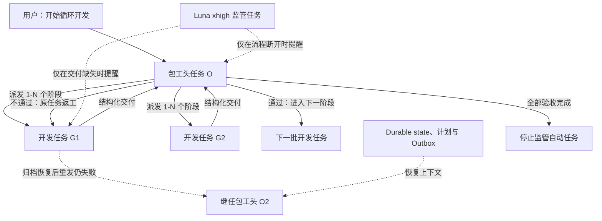

# Codex Loop Development

一套面向 Codex 桌面端的循环开发编排协议：让一个“包工头”任务按计划调度多个开发任务，独立完成审核、返工、下一阶段派发和最终收尾；另设一个 Luna xhigh 监管任务，只在消息链或状态转换断开时兜底。总包任务损坏时，系统可以从持久状态自动创建继任总包。

> 当前版本：`v1.1.0`

## 它解决什么问题

长周期、多阶段开发很容易在任务之间出现断点：worker 已交付但无人审核、总包消息入口损坏、审核通过后没有继续派工、应用重启后忘记当前阶段，或者监管任务越权代替主任务决策。

本项目通过固定角色、结构化事件和本地持久状态，把这些动作串成可恢复的闭环：



## 核心原则

- 包工头是唯一审核、返工和派工决策者。
- worker 完成后先把报告写入不可变 Outbox，再主动向当前包工头发送结构化提醒。
- 包工头派发或返工后结束当前回合，不持续轮询。
- 所有施工线程固定使用 `gpt-5.6-luna`、`max` 推理；继任总包也从 durable state 读取并保持该配置。
- 监管任务不审代码、不改仓库、不替包工头决策，只检查最早缺失的状态转换。
- 每次运行使用唯一 `runId`，并把进度、总包代际和重要决定持久化到本地。
- 第一次明确消息发送失败后，单一修复持有者先对旧总包执行 archive → unarchive 并重发；重发仍失败才原子抢占并创建继任总包。
- 监管自动任务始终绑定独立监管线程，通过 durable state 动态发现当前总包，不在切换时改绑。
- 所有阶段验收完成后，包工头将关联自动任务设为 `INACTIVE`。

## 安装

### Windows 自动安装

下载或克隆本仓库，在 PowerShell 中执行：

```powershell
Set-ExecutionPolicy -Scope Process Bypass
.\install.ps1
```

只检查文件、不安装：

```powershell
.\install.ps1 -ValidateOnly
```

脚本不会覆盖已有的同名技能。完整说明见[安装说明](安装说明.md)。

### 手动安装

将 `loop-development` 整个目录复制到：

```text
%CODEX_HOME%\skills\loop-development
```

未设置 `CODEX_HOME` 时，Windows 默认是 `%USERPROFILE%\.codex\skills\loop-development`。

## 快速开始

先在目标仓库里写好带阶段 ID、依赖、写入范围与验收标准的开发计划，然后在准备充当包工头的 Codex 任务中输入：

```text
开始循环开发。

请使用 $loop-development，将当前任务作为唯一包工头 O。

runId：<本次运行的唯一名称>
主计划：<开发计划的绝对路径>
Checklist 或索引：<可选，Checklist 的绝对路径>

请根据计划、依赖、写入范围和当前仓库状态，自行决定第一批启动 1–N 个开发任务。

要求：
- 开发任务直接使用当前保存项目的 local 环境。
- 所有开发任务固定使用 gpt-5.6-luna、max 推理。
- 不创建 worktree 或分支，不自动 commit。
- 包工头负责独立审核、返工和下一阶段派发。
- worker 完成或阻塞后必须主动向包工头发送结构化报告。
- worker 交付前先写入不可变 Outbox；首次明确发送失败时先归档并恢复总包，重发仍失败才按协议创建继任总包。
- 创建独立 Luna xhigh 监管任务和 20 分钟定时任务；监管只负责兜底。
- 派发完成后结束当前回合，不持续轮询。
- 不得越过计划中的用户决策门。
```

从计划编写、预检、启动到暂停、恢复和收尾的完整步骤，见[中文使用教程](Codex循环开发系统使用教程.md)。

## 仓库内容

```text
.
├─ loop-development/                  # 可安装的 Codex skill
│  ├─ SKILL.md                        # 总协议与入口
│  ├─ agents/openai.yaml              # 技能元数据
│  ├─ references/                     # 包工头、worker、监管与事件协议
│  └─ scripts/                        # 状态接管、报告 Outbox 与 manifest 工具
├─ tests/failover-smoke.mjs           # 故障转移冒烟测试
├─ package.json                       # 无依赖的检查与测试入口
├─ Codex循环开发系统使用教程.md        # 从零开始教程
├─ 安装说明.md                         # 安装、升级与卸载
├─ install.ps1                        # Windows 安装脚本
└─ VERSION.txt
```

## 运行要求与边界

- 面向支持任务创建、任务读取、任务间消息与自动任务的 Codex 桌面端。
- 推荐监管任务使用 Luna、`xhigh` 推理。
- 本仓库不包含作者电脑上的任务、自动任务、仓库路径、运行状态或凭据。
- 安装技能不会自动启动任何开发流程；只有用户在自己的仓库中明确输入启动 Prompt 后才会创建相关任务。
- 本项目是一套编排协议与模板，不替代项目自身的测试、代码评审标准或人工决策门。
- 自动接管依赖 Codex 桌面端/app server 仍可执行任务工具；宿主完全关闭时会在下次启动后继续恢复。

## License

本仓库暂未附带开源许可证。在仓库所有者添加明确的许可证之前，默认保留全部权利。
